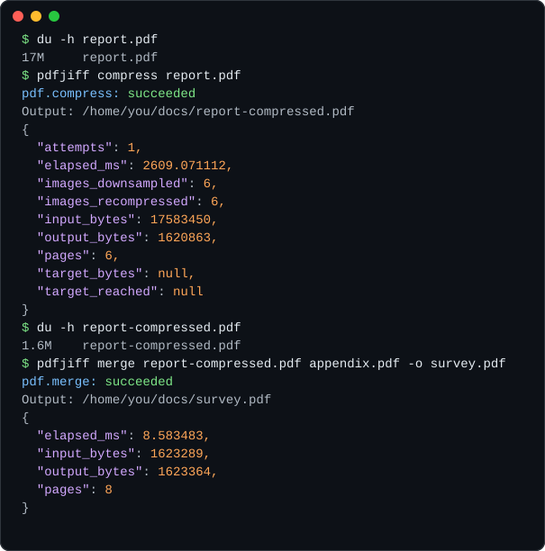

<div align="center">

<h1></h1>

**Fast, private PDF tools for your terminal.**<br>
Compress, merge and inspect PDFs locally. No uploads, no accounts, no server. One small binary.

[](https://github.com/pdfjiff/pdfjiff/actions/workflows/ci.yml)
[](https://github.com/pdfjiff/pdfjiff/releases/latest)
[](https://crates.io/crates/pdfjiff-cli)
[](https://docs.rs/pdfjiff-core)
[](#license)



</div>

## Why PDFJiff?

- **Your files never leave your machine.** Everything runs locally and offline. There is no telemetry, no network access and no background service.
- **Fast.** Native Rust. The 17 MB, six-photo report above compresses to 1.6 MB in about 2.5 seconds. Inspecting or merging small documents takes milliseconds.
- **Safe by default.** Inputs are never modified. Existing files are never overwritten unless you pass `--overwrite`. Outputs are written to a temporary file and moved into place atomically, so a failure never leaves a half-written PDF behind.
- **Built for scripts, CI and AI agents.** `--json` prints one versioned result with stable error codes and meaningful exit codes. You never have to parse human-readable text.
- **Runs anywhere.** macOS, Linux (static binary, any distro) and Windows, on x86-64 and ARM64. You can also run it from Docker or a GitHub Action.

## Install

| Platform | Command |
| --- | --- |
| macOS / Linux | `curl -fsSL https://github.com/pdfjiff/pdfjiff/releases/latest/download/install.sh \| sh` |
| Windows (PowerShell) | `irm https://github.com/pdfjiff/pdfjiff/releases/latest/download/install.ps1 \| iex` |
| Homebrew | `brew install pdfjiff/tap/pdfjiff` |
| Scoop | `scoop bucket add pdfjiff https://github.com/pdfjiff/scoop-bucket` then `scoop install pdfjiff` |
| Cargo (prebuilt) | `cargo binstall pdfjiff-cli` |
| Cargo (from source) | `cargo install pdfjiff-cli --locked` |
| Docker | `docker run --rm -v "$PWD:/work" ghcr.io/pdfjiff/pdfjiff --help` |
| GitHub Actions | `uses: pdfjiff/pdfjiff@v0` (see [CI usage](#use-it-in-ci)) |

Prefer to download the files yourself? Every [release](https://github.com/pdfjiff/pdfjiff/releases/latest) includes archives for six platforms, a `SHA256SUMS` file and signed build-provenance attestations. See [docs/install.md](docs/install.md) for verification, shell completions, upgrading, uninstalling and troubleshooting.

## Quick start

```bash
pdfjiff inspect report.pdf                                # pages, sizes, encryption, signatures
pdfjiff compress report.pdf                               # writes report-compressed.pdf
pdfjiff compress report.pdf --target 2MB -o upload.pdf    # fit an upload limit
pdfjiff compress report.pdf --lossless -o optimized.pdf   # keep every image pixel
pdfjiff merge cover.pdf report.pdf -o combined.pdf        # merge in argument order
```

Use `pdfjiff --help` or `pdfjiff <command> --help` for every option.

## Commands

| Command | What it does |
| --- | --- |
| `inspect <PDF>` | Reports page count, page sizes and rotation, encryption, signatures and document structures. |
| `compress <PDF>` | Recompresses images with the `quality`, `balanced` (default) or `small` preset. Use `--lossless` to optimize structure only, or `--target 2MB` to try up to six increasingly compact settings until the file fits. |
| `merge <PDF> <PDF>...` | Merges files in the order given. Requires `-o/--output`. |
| `capabilities` | Lists what this build supports and its limitations. This is the authority for scripts. |
| `completions <SHELL>` | Prints tab-completion scripts for bash, zsh, fish, PowerShell and elvish. |

Useful flags: `--dry-run` shows what would happen without writing a file. `--overwrite` allows replacing an existing output. Size units are explicit: `2MB` is 2,000,000 bytes and `2MiB` is 2,097,152 bytes.

[docs/usage.md](docs/usage.md) is the full reference. It covers every option, the safety model, the JSON schema, exit codes and error codes.

## Scripting and automation

Add `--json` to any command to get exactly one JSON object on stdout:

```console
$ pdfjiff compress report.pdf --target 1MB --json
{"coverage":{"rendered":false,"signature_validation":false},"error":null,"operation":"pdf.compress","outputs":[{"path":"/home/you/docs/report-compressed.pdf"}],"result":{"unchanged":false},"schema_version":1,"stats":{"attempts":3,"elapsed_ms":6911.995227,"images_downsampled":6,"images_recompressed":6,"input_bytes":17583450,"output_bytes":590066,"pages":6,"target_bytes":1000000,"target_reached":true},"status":"succeeded","warnings":[]}

$ pdfjiff compress report.pdf --target 1MB --json; echo "exit=$?"
{"coverage":{"rendered":false,"signature_validation":false},"error":{"code":"OUTPUT_EXISTS","hint":"Choose --output or explicitly use --overwrite.","message":"/home/you/docs/report-compressed.pdf already exists."},"operation":"pdf.compress","outputs":[],"result":null,"schema_version":1,"stats":{},"status":"failed","warnings":[]}
exit=2
```

- Exit code `0` means success. Other exit codes identify the category of failure: `2` for usage or output problems, `3` for invalid input, `4` when a password is required, `6` when a size limit or target cannot be met, `7` when processing fails and `130` when the run is cancelled.
- When a run fails, `error.code` gives a stable identifier (for example `TARGET_UNREACHABLE` or `OUTPUT_EXISTS`) and `error.hint` says what to do next. Match on codes, never on messages.

```bash
# Compress every PDF in a folder; report the ones that fail and keep going
mkdir -p small
for f in invoices/*.pdf; do
  pdfjiff compress "$f" -o "small/$(basename "$f")" --json > /dev/null || echo "failed: $f" >&2
done
```

### Use it in CI

```yaml
- uses: pdfjiff/pdfjiff@v0
- run: pdfjiff compress docs/manual.pdf --target 5MB -o dist/manual.pdf
```

### Use it with Docker

```bash
docker run --rm --user "$(id -u):$(id -g)" -v "$PWD:/work" \
  ghcr.io/pdfjiff/pdfjiff compress report.pdf
```

The image is built `FROM scratch` and contains only the static `pdfjiff` binary. It is a few megabytes, has no shell or package manager, and runs as a non-root user by default.

## Use the Rust library

The algorithms live in [`pdfjiff-core`](crates/pdfjiff-core), so you can embed them in your own tools:

```toml
[dependencies]
pdfjiff-core = "0.1"
```

```rust
use pdfjiff_core::compress::{try_compress, CompressOptions, CompressionPreset};
use pdfjiff_core::pages::PdfMerger;

let input = std::fs::read("report.pdf")?;
let info = pdfjiff_core::inspect(&input)?;
println!("{:?} pages, encrypted: {}", info.page_count, info.encrypted);

let options = CompressOptions::from_preset(CompressionPreset::Balanced);
let mut result = try_compress(&input, &options)?;
println!("{} -> {} bytes", input.len(), result.compressed_size());
std::fs::write("report-small.pdf", result.take())?;

let mut merger = PdfMerger::try_new()?;
for path in ["cover.pdf", "report-small.pdf"] {
    merger.try_add_document(&std::fs::read(path)?)?;
}
std::fs::write("combined.pdf", merger.try_finish()?)?;
```

The library API is pre-1.0 and may change between minor versions. The [crate docs](https://docs.rs/pdfjiff-core) describe each type.

## Project status

PDFJiff is an early release (0.x). The commands listed above work and are tested on every change. Their JSON contract is versioned (`schema_version: 1`). Work in progress:

- More operations: split, rotate, reorder, images to PDF and PDF to images
- Batch processing and multi-step pipelines
- Opening password-protected files
- A local web UI (planned last)

Want to help shape it? Look through [open issues](https://github.com/pdfjiff/pdfjiff/issues), especially those labelled [`good first issue`](https://github.com/pdfjiff/pdfjiff/labels/good%20first%20issue), or start a thread in [Discussions](https://github.com/pdfjiff/pdfjiff/discussions).

**Maintenance.** PDFJiff is maintained on a best-effort basis. Security reports come first (see [SECURITY.md](SECURITY.md)). Bug reports with a reproduction come next. Feature requests are read and discussed, but there is no guaranteed timeline. Releases ship when there is something worth shipping, and every release is tested on Linux, macOS and Windows.

## Known limitations

These are listed up front so there are no surprises:

- `inspect` reads the PDF's structure. It does not render pages or check whether signatures are valid.
- Rewriting a signed PDF invalidates its signatures. PDFJiff stops unless you pass `--allow-signature-invalidation`.
- `merge` combines pages but not document metadata. It refuses inputs containing structures it cannot keep, such as bookmarks, forms, links or XMP metadata, unless you pass `--allow-structure-loss`. With that flag it merges anyway and reports each item it drops. Many office-exported PDFs contain at least one of these structures.
- Encrypted PDFs must be decrypted before they can be compressed or merged.
- Input size limits (`--max-input-mib`, `--max-total-input-mib`) cap the bytes read from disk. They do not limit peak memory use.

## Contributing

Contributions of all sizes are welcome: bug reports, sample-PDF edge cases, docs fixes and new commands. You can get from `git clone` to a passing test suite in a few minutes. [CONTRIBUTING.md](CONTRIBUTING.md) explains the setup, the project layout and how pull requests are reviewed.

This project follows the [Code of Conduct](CODE_OF_CONDUCT.md). To report a security issue, follow [SECURITY.md](SECURITY.md); do not open a public issue. For help, see [SUPPORT.md](SUPPORT.md).

## License

Licensed under either of

- Apache License, Version 2.0 ([LICENSE-APACHE](LICENSE-APACHE) or <https://www.apache.org/licenses/LICENSE-2.0>)
- MIT license ([LICENSE-MIT](LICENSE-MIT) or <https://opensource.org/licenses/MIT>)

at your option.

Unless you explicitly state otherwise, any contribution intentionally submitted for inclusion in the work by you, as defined in the Apache-2.0 license, shall be dual licensed as above, without any additional terms or conditions.

Release binaries also include `THIRD-PARTY-LICENSES.md`, which lists the open-source crates compiled into `pdfjiff` and reproduces their licenses.

The PDFJiff name and bird logo are not covered by these licenses. You are welcome to use them to refer to this project. Please don't use them for forks or other products in a way that suggests they are the official PDFJiff or are endorsed by it.
